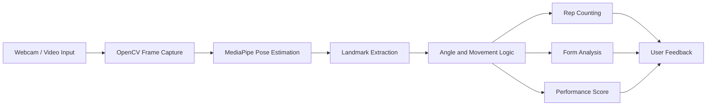

# AI Fitness Coach - Real-Time Pushup Analysis


AI Fitness Coach is a computer vision system for pushup counting, posture checks, form analysis, and performance feedback.

## Demo

- Demo video: Coming soon
- Live demo: Coming soon
- Portfolio case study: Add portfolio link here

## Problem Statement

Many exercise apps count reps but do not explain form quality. AI Fitness Coach uses pose estimation to convert body landmarks into measurable coaching signals.

## Why This Project Matters

This project shows that computer vision can become a personalized feedback product, not just a visual demo. It combines real-time tracking, rule-based movement analysis, scoring, and future AI coaching.

## Architecture Diagram



## Features

- Real-time video processing
- Pose estimation with body landmarks
- Pushup rep counting
- Posture and form checks
- Performance scoring
- Foundation for personalized AI coaching feedback

## Screenshots

Add screenshots when available:

| Pose Detection | Rep Counter | Feedback Screen |
| --- | --- | --- |
| `screenshots/pose.png` | `screenshots/counter.png` | `screenshots/feedback.png` |

## Tech Stack

- Python
- OpenCV
- MediaPipe
- Computer Vision
- Pose Estimation

## Installation

```bash
git clone https://github.com/<username>/ai-fitness-coach.git
cd ai-fitness-coach
python -m venv .venv
.venv\Scripts\activate
pip install -r requirements.txt
```

Run the app:

```bash
python src/main.py
```

## Usage

1. Place the camera so the full upper body is visible.
2. Start the application.
3. Perform pushups in frame.
4. Review rep count, form feedback, and performance score.

Optional video-file mode:

```bash
python src/main.py --video samples/pushup_demo.mp4
```

## Ideal Repository Structure

```text
ai-fitness-coach/
  src/
    vision/
      pose_detector.py
      landmark_utils.py
    analysis/
      rep_counter.py
      form_checker.py
      scoring.py
    ui/
      overlay.py
    main.py
  samples/
    README.md
  tests/
    test_angles.py
    test_rep_counter.py
  docs/
    architecture.md
    movement_logic.md
  screenshots/
  .github/
    workflows/
      ci.yml
  requirements.txt
  README.md
```

## Key Technical Challenges

- Converting noisy pose landmarks into stable movement signals
- Avoiding false rep counts from partial motion
- Designing posture checks that are explainable
- Handling camera angle and visibility limitations
- Keeping real-time performance smooth

## What I Learned

- Computer vision products need domain logic after detection
- Landmark smoothing and thresholds affect user trust
- Feedback should be simple, actionable, and not overconfident
- Real-time systems require careful performance tradeoffs

## Future Roadmap

- Add more exercises
- Add personalized coaching recommendations
- Add session history and progress tracking
- Add mobile-friendly frontend
- Add calibration for different body types and camera angles
- Add evaluation with sample videos

## GitHub Actions Placeholder

Recommended `.github/workflows/ci.yml`:

```yaml
name: CI

on:
  push:
  pull_request:

jobs:
  test:
    runs-on: ubuntu-latest
    steps:
      - uses: actions/checkout@v4
      - uses: actions/setup-python@v5
        with:
          python-version: "3.10"
      - run: pip install -r requirements.txt
      - run: pytest
```
