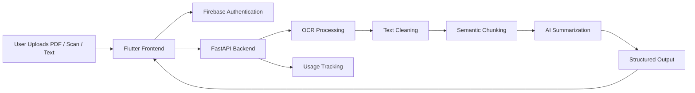

# Lumina AI - Intelligent Document Processing Platform


Lumina AI is an intelligent document processing platform that turns PDFs, scans, and raw text into structured summaries and usable outputs through an API-first workflow.

## Demo

- Live demo: Coming soon
- API docs: Coming soon
- Portfolio case study: Add portfolio link here

## Problem Statement

Messy PDFs and scanned documents are hard to search, summarize, structure, and reuse. A useful document AI system needs more than a model call: it needs OCR, chunking, summarization, authentication, usage tracking, and product integration.

## Why This Project Matters

Lumina AI demonstrates end-to-end AI product thinking. It connects document ingestion, text extraction, semantic processing, backend APIs, authentication, and user-facing output into one deployable workflow.

## Architecture Diagram



## Features

- PDF, scan, and raw text ingestion
- OCR processing for scanned documents
- Document understanding pipeline
- Semantic chunking for long-form documents
- AI summarization workflow
- FastAPI backend endpoints
- Firebase authentication flow
- Usage tracking for product behavior
- Flutter integration for user-facing access

## Screenshots

Add screenshots when available:

| Upload Flow | Summary Output | Usage Dashboard |
| --- | --- | --- |
| `screenshots/upload.png` | `screenshots/summary.png` | `screenshots/usage.png` |

## Tech Stack

- Python
- FastAPI
- OCR processing
- NLP
- Hugging Face
- Firebase Authentication
- Flutter
- REST APIs

## Installation

```bash
git clone https://github.com/<username>/lumina-ai.git
cd lumina-ai
python -m venv .venv
.venv\Scripts\activate
pip install -r requirements.txt
```

Create a `.env` file:

```env
FIREBASE_PROJECT_ID=your_project_id
FIREBASE_CREDENTIALS_PATH=path_to_credentials.json
MODEL_NAME=your_model_name
```

Run the backend:

```bash
uvicorn app.main:app --reload
```

## Usage

1. Start the FastAPI server.
2. Authenticate through the frontend or API token flow.
3. Upload a PDF, scan, or text file.
4. Run OCR and document parsing.
5. Generate summaries and structured outputs.
6. Review usage tracking events.

Example API request:

```bash
curl -X POST http://localhost:8000/documents/process \
  -H "Authorization: Bearer <token>" \
  -F "file=@sample.pdf"
```

## Ideal Repository Structure

```text
lumina-ai/
  app/
    api/
      routes/
      dependencies.py
    core/
      config.py
      security.py
    services/
      ocr_service.py
      chunking_service.py
      summarization_service.py
      usage_service.py
    schemas/
      document.py
      summary.py
    main.py
  frontend/
    lib/
    assets/
  tests/
    test_ocr_service.py
    test_document_routes.py
  docs/
    architecture.md
    api.md
  screenshots/
  .github/
    workflows/
      ci.yml
  requirements.txt
  .env.example
  README.md
```

## Key Technical Challenges

- Handling noisy OCR output from scans
- Chunking long documents without losing semantic context
- Keeping summarization outputs structured and useful
- Connecting auth, usage tracking, and AI inference cleanly
- Designing APIs that a frontend can consume reliably

## What I Learned

- AI products need orchestration, not just model output
- OCR quality strongly affects downstream NLP quality
- API design matters when AI outputs are used in real workflows
- Usage tracking helps connect model behavior to product decisions

## Future Roadmap

- Add document search with embeddings
- Add user-specific document history
- Add export to Markdown, PDF, and JSON
- Add background jobs for large files
- Add automated evaluation for summary quality
- Deploy backend and publish public API docs

## GitHub Actions Placeholder

Recommended `.github/workflows/ci.yml`:

```yaml
name: CI

on:
  push:
  pull_request:

jobs:
  test:
    runs-on: ubuntu-latest
    steps:
      - uses: actions/checkout@v4
      - uses: actions/setup-python@v5
        with:
          python-version: "3.10"
      - run: pip install -r requirements.txt
      - run: pytest
```
