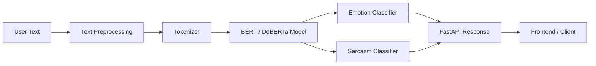

# MoodLens - Emotion and Sarcasm Detection Platform


MoodLens is a transformer-based NLP application for detecting emotion and sarcasm in short user text.

## Demo

- Live demo: Coming soon
- API docs: Coming soon
- Portfolio case study: Add portfolio link here

## Problem Statement

Basic sentiment tools often miss sarcasm, mixed emotions, and subtle tone. MoodLens focuses on richer text understanding by classifying emotional signals and sarcasm instead of returning only positive, negative, or neutral sentiment.

## Why This Project Matters

MoodLens shows applied transformer thinking. It turns a real NLP limitation into a model-backed product flow with inference design, API delivery, and user-facing interpretation.

## Architecture Diagram



## Features

- Emotion classification for short-form text
- Sarcasm detection
- Transformer model workflow using BERT / DeBERTa direction
- FastAPI inference endpoint
- Clean API response format
- Practical NLP use case beyond basic sentiment analysis

## Screenshots

Add screenshots when available:

| Input Screen | Prediction Output | API Docs |
| --- | --- | --- |
| `screenshots/input.png` | `screenshots/output.png` | `screenshots/docs.png` |

## Tech Stack

- Python
- FastAPI
- Hugging Face Transformers
- BERT / DeBERTa
- NLP
- REST APIs

## Installation

```bash
git clone https://github.com/<username>/moodlens.git
cd moodlens
python -m venv .venv
.venv\Scripts\activate
pip install -r requirements.txt
```

Create a `.env` file:

```env
MODEL_PATH=./models/moodlens
API_ENV=development
```

Run the backend:

```bash
uvicorn app.main:app --reload
```

## Usage

Example request:

```bash
curl -X POST http://localhost:8000/predict \
  -H "Content-Type: application/json" \
  -d "{\"text\":\"Sure, because waiting three hours was exactly what I wanted.\"}"
```

Example response:

```json
{
  "text": "Sure, because waiting three hours was exactly what I wanted.",
  "emotion": "frustration",
  "sarcasm": true,
  "confidence": 0.91
}
```

## Ideal Repository Structure

```text
moodlens/
  app/
    api/
      routes/
    core/
      config.py
    models/
      predictor.py
      tokenizer.py
    schemas/
      prediction.py
    main.py
  notebooks/
    model_experiments.ipynb
  training/
    train.py
    evaluate.py
    data_preprocessing.py
  tests/
    test_predictor.py
    test_api.py
  docs/
    model_card.md
    architecture.md
  screenshots/
  .github/
    workflows/
      ci.yml
  requirements.txt
  .env.example
  README.md
```

## Key Technical Challenges

- Detecting sarcasm when literal text conflicts with implied meaning
- Handling short text with limited context
- Choosing appropriate transformer architecture and tokenization strategy
- Designing output labels that are understandable to users
- Serving NLP inference through a clean API

## What I Learned

- Sentiment analysis is often too shallow for real tone understanding
- Transformers can capture richer language signals than keyword logic
- Model confidence needs careful communication in product interfaces
- API response design is part of the ML user experience

## Future Roadmap

- Add multi-label emotion classification
- Add model evaluation metrics in the README
- Add a model card with dataset notes and limitations
- Add frontend demo
- Add batch inference support
- Deploy API with public Swagger docs

## GitHub Actions Placeholder

Recommended `.github/workflows/ci.yml`:

```yaml
name: CI

on:
  push:
  pull_request:

jobs:
  test:
    runs-on: ubuntu-latest
    steps:
      - uses: actions/checkout@v4
      - uses: actions/setup-python@v5
        with:
          python-version: "3.10"
      - run: pip install -r requirements.txt
      - run: pytest
```
